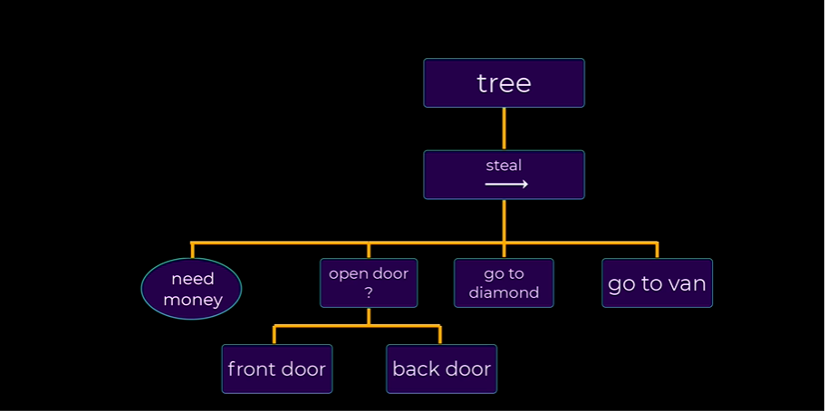

# Behavior Tree
* Nodes
- [x] LeafNode
- [x] SequenceNode [Composite Node]
- [x] SelectorNode [Composite Node]
- [x] InverterNode [Decorator Node]

## Robo steal diamond if he has money less than 500.If he rob the diamond and keep the diamond in the van then he get 500 money.

Here Leaf nodes are action node, Sequence node run its child action nodes sequentally. Selector node is select a node if one child failed.

## Dependency :
1. [UI Builder - V-1.0.0](https://docs.unity3d.com/Packages/com.unity.ui.builder@1.0/manual/index.html)
2. [Wolf Animated](https://assetstore.unity.com/packages/3d/characters/animals/wolf-animated-45505)

## Credits
[[Kiwi Coder](https://www.youtube.com/c/TheKiwiCoder)'s YT Tutorial [1](https://www.youtube.com/watch?v=nKpM98I7PeM&list=PLyBYG1JGBcd009lc1ZfX9ZN5oVUW7AFVy&index=11) [2](https://www.youtube.com/watch?v=jhB_GFgS6S0&list=PLyBYG1JGBcd009lc1ZfX9ZN5oVUW7AFVy&index=12)]

[[Unity-Learn](https://learn.unity.com/tutorial/introducing-behaviour-trees?uv=2020.2&projectId=60645258edbc2a001f5585aa)]

[[Article](https://www.gamedeveloper.com/programming/behavior-trees-for-ai-how-they-work)]

## Summary
* **Leaf Node** is a Action Node which does not have any child.It return Running,Failure or Success to the parent Node.

* **Sequence Node** is a Composite node i.e which have multiple child. If a child Node fails then it will return Failure to the parent and does not perform next Child Node operation. It will return Success to parent only if all child Operation get success. It is like And gate operation.

* **Selector Node** is a Composite Node.If any Child Fails then perform next Child Operation untill last Child. It will return Success to parent if at least one Child get Success. It will return Failure to parent if all child operation fails. It is like OR gate Operation.

* **Inverter Node** is a Decorator Node which have only Single Node. It will return Failure if Children Status is Succcess and will return Success if child operation status is Failure otherwise it is returning Running to parent node.

There should be more Nodes like **Wait Node** , **Repeat Infinite Node**, **Repeat Finite Node** etc.
