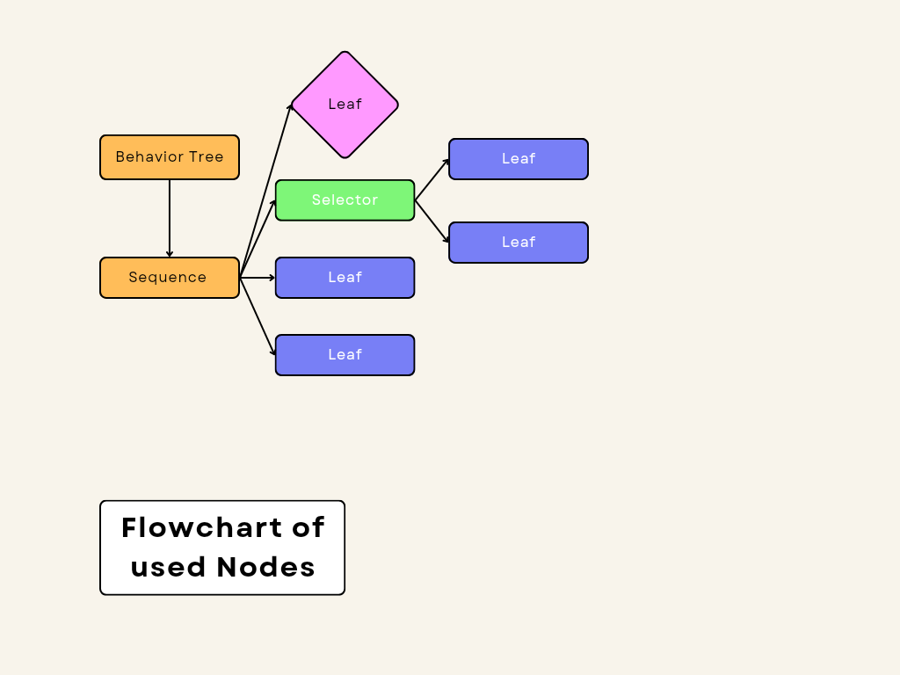

# Behavior Tree
* Nodes
- [x] LeafNode
- [x] SequenceNode [Composite Node]
- [x] SelectorNode [Composite Node]
- [x] InverterNode [Decorator Node]

## Robo steal diamond if he has money less than 500.If he rob the diamond and keep the diamond in the van then he get 500 money.

Here Leaf nodes are action node, Sequence node run its child action nodes sequentally. Selector node is select a node if one child failed.

## Credits
[[Unity-Learn](https://learn.unity.com/tutorial/introducing-behaviour-trees?uv=2020.2&projectId=60645258edbc2a001f5585aa)]
[[Article](https://www.gamedeveloper.com/programming/behavior-trees-for-ai-how-they-work)]

